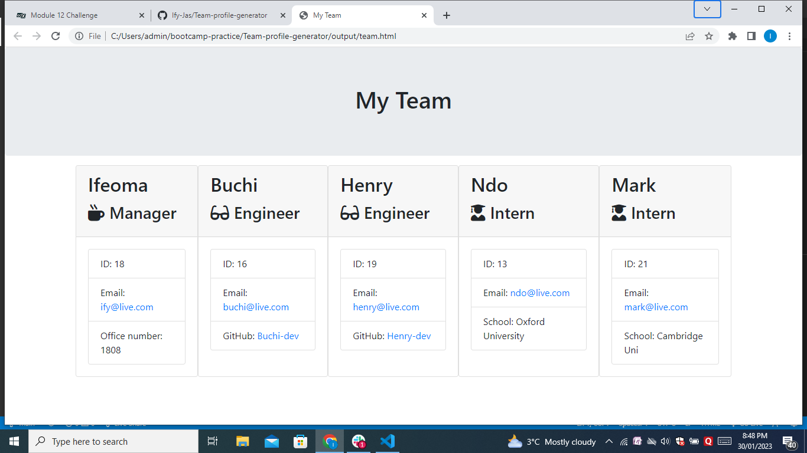

# Team-profile-generator

 ## Description
  This project was about utilising all we learnt about back end command line programming using Node.js and ES6. The past week concentrated on object orientated programming(OOP). The project concentrates mainly on the concept of inheritance on OOP using classes and constructors.

  This work generates a Team webpage with different roles who have inherited some properties from the parent class. I make use of inquirer.js to prompt the user for information.

  ## Table of Content
  * [Installation](#Installation)
  * [Usage](#Usage)
  * [License](#License)
  * [Contributors](#Contributors)
  * [Tests](#Tests)
  * [Contacts](#Contacts)
  
  

  
  ## Installation
  The user will need to download Node.js onto their system, then run a NPM init, NPM install inquirer.

  If the user already has this, then all that is needed is a git clone and run in the command line by calling 'node index.js'.

  For testing, the user needs to install the jest, see jestjs.io for more information

  
  ## Usage
  This terminal app is used to generated and HTML file for team members. See sample of a generated HTML page below;

  

  ## License
  MIT License

  
  ## Contributors
  NA

  
  ## Tests
  Jest was used for testing.

  
  ## Contact
  Link to Repo: github.com/ify-jas

  Email: ifyezeoke@gmail.com
